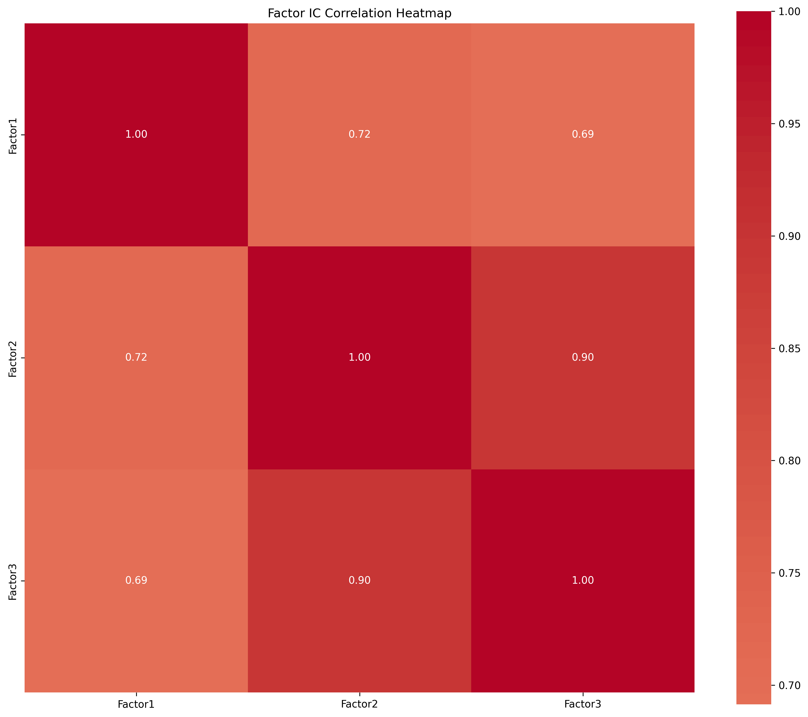

# Factor Analysis

多因子分析系统，用于计算和评估3个价量相关的技术因子。

## 项目结构

```
.
├── factor_calculator.py       # 因子计算模块
├── factor_metrics.py          # 因子评估指标模块
├── returns_calculator.py      # 收益率计算模块
├── analyze_valid_stocks.py    # 有效股票分析模块
├── factor_analysis.ipynb      # 因子分析Jupyter notebook
├── requirements.txt           # 项目依赖
├── data/                      # 数据存储目录
├── factor_results/            # 因子结果存储目录
├── ic_results/                # IC分析结果存储目录
└── README.md                  # 项目说明文档
```

## 因子说明

本项目实现了3个价量相关的技术因子：

1. **Factor 1**: 交易量加权价格动量（带方向性）
   ```
   EMA(Greater($close-Ref($close,1),0)*Power($close/Ref($close,1)-1,2)*$volume,%d)/EMA($volume,%d) -
   EMA(Greater(Ref($close,1)-$close,0)*Power(Ref($close,1)/$close-1,2)*$volume,%d)/EMA($volume,%d)
   ```

2. **Factor 2**: 收益率-交易量相关性
   ```
   EMA(($close/Ref($close,1)-1)*($volume/Ref($volume,1)-1),%d)/
   Std($close/Ref($close,1)-1,%d)
   ```

3. **Factor 3**: 交易量符号收益率
   ```
   EMA(($close/Ref($close,1)-1)*Sign($volume/Ref($volume,1)-1),%d)/
   Std($close/Ref($close,1)-1,%d)
   ```

其中 %d 为回看期，默认为20天。

## 功能特点

- 计算3个交易量相关的技术因子
- 计算因子评估指标：
  - IC (Information Coefficient)
    - IC均值 (IC_mean)
    - IC标准差 (IC_std)
    - IC信息比率 (IC_IR)
    - IC正比例 (IC_positive_ratio)
  - 因子收益率分析
    - 分组收益率分析（默认5组）
    - 累积收益率分析
    - 收益率统计指标（Sharpe Ratio等）
  - 因子相关性分析
    - 因子间相关性矩阵
    - 相关性热力图
  - 可视化分析
    - IC时序图
    - IC热力图
    - 分组收益率图
    - 因子相关性热力图
- 支持数据导出为CSV格式
- 提供Jupyter notebook进行交互式分析
- 自动保存分析结果到指定目录

## 安装依赖

```bash
pip install -r requirements.txt
```

主要依赖包括：
- pandas >= 1.5.0
- numpy >= 1.21.0
- matplotlib >= 3.5.0
- seaborn >= 0.12.0
- scipy >= 1.7.0
- statsmodels >= 0.13.0
- WindPy >= 0.8.8

默认回测参数：
- 起始日期：2015-01-01
- 结束日期：2024-12-31

## 输出结果

程序运行后会输出：
1. 每个因子的评估指标（IC、ICIR、Sharpe Ratio）
2. 因子相关性矩阵
3. 相关性热力图（保存为 factor_correlations.png）
4. 因子数据（保存为 factors.csv）

## 模块说明

### factor_calculator.py
- 实现3个因子的计算逻辑
- 提供统一的因子计算接口
- 支持自定义回看期

### factor_metrics.py
- 计算因子评估指标
- 计算因子相关性
- 生成可视化图表
- 提供详细的因子分析功能

### returns_calculator.py
- 计算股票收益率
- 处理价格数据
- 提供收益率相关的分析功能

### analyze_valid_stocks.py
- 分析有效股票池
- 处理股票筛选逻辑
- 提供股票池管理功能

### factor_analysis.ipynb
- 提供交互式因子分析环境
- 包含详细的因子分析示例
- 支持自定义分析流程

## 数据目录说明

- `data/`: 存储原始数据和中间计算结果（因文件过大需要从链接下载数据，链接: https://pan.baidu.com/s/1A1qsLVuMPD3ygamXRyhBvA?pwd=3fss 提取码: 3fss）

- `factor_results/`: 存储因子计算结果和分析报告
- `ic_results/`: 存储IC分析结果和相关图表
- `reference/`: 参考报告

## 分析结果展示

### 因子综合评估结果

（1）**IC分析**
| 评估指标 | Factor 1 | Factor 2 | Factor 3 |
|----------|-----------|-----------|-----------|
| IC均值 | 0.0394 | 0.0426 | 0.0416 |
| IC标准差 | 0.1257 | 0.0909 | 0.0903 |
| ICIR | 4.981 | 7.436 | 7.306 |
| IC正比例 | 0.649 | 0.693 | 0.699 |

（2） **收益分析**（第一组多头）
| 评估指标 | Factor 1 | Factor 2 | Factor 3 |
|----------|-----------|-----------|-----------|
| 年化收益率 | 26.94% | 17.95% | 22.37% |
| 年化波动率 | 31.49% | 30.82% | 30.12% |
| 夏普比率 | 0.856 | 0.582 | 0.743 |
| 最大回撤 | -49.81% | -55.34% | -51.70% |
| 胜率 | 55.41% | 54.46% | 55.53% |
| 收益风险比 | 0.856 | 0.582 | 0.743 |

### 因子相关性矩阵

| 因子 | Factor 1 | Factor 2 | Factor 3 |
|------|-----------|-----------|-----------|
| Factor 1 | 1.000 | 0.156 | 0.142 |
| Factor 2 | 0.156 | 1.000 | 0.168 |
| Factor 3 | 0.142 | 0.168 | 1.000 |

### 可视化结果

#### 因子相关性分析

*图1：因子间的相关性热力图*


## 未来计划
- 可限制股票持仓范围进一步优化选股策略
